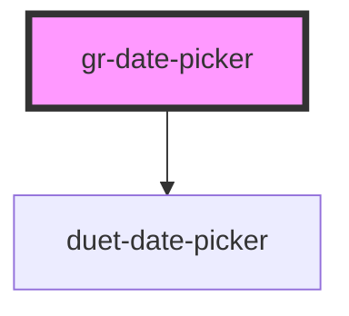

# gr-date-picker

<!-- Auto Generated Below -->

## Properties

| Property         | Attribute           | Description                                                                                                                                                                                                                    | Type                                                                                                                                                      | Default             |
| ---------------- | ------------------- | ------------------------------------------------------------------------------------------------------------------------------------------------------------------------------------------------------------------------------ | --------------------------------------------------------------------------------------------------------------------------------------------------------- | ------------------- |
| `direction`      | `direction`         | Forces the opening direction of the calendar modal to be always left or right. This setting can be useful when the input is smaller than the opening date picker would be as by default the picker always opens towards right. | `"left" \| "right"`                                                                                                                                       | `'right'`           |
| `disabled`       | `disabled`          | Makes the date picker input component disabled. This prevents users from being able to interact with the input, and conveys its inactive state to assistive technologies.                                                      | `boolean`                                                                                                                                                 | `false`             |
| `firstDayOfWeek` | `first-day-of-week` | Which day is considered first day of the week? `0` for Sunday, `1` for Monday, etc. Default is Monday.                                                                                                                         | `DaysOfWeek.Friday \| DaysOfWeek.Monday \| DaysOfWeek.Saturday \| DaysOfWeek.Sunday \| DaysOfWeek.Thursday \| DaysOfWeek.Tuesday \| DaysOfWeek.Wednesday` | `DaysOfWeek.Monday` |
| `isDateDisabled` | --                  | Controls which days are disabled and therefore disallowed. For example, this can be used to disallow selection of weekends.                                                                                                    | `(date: Date) => boolean`                                                                                                                                 | `() => false`       |
| `max`            | `max`               | Maximum date allowed to be picked. Must be in IS0-8601 format: YYYY-MM-DD. This setting can be used alone or together with the min property.                                                                                   | `string`                                                                                                                                                  | `''`                |
| `min`            | `min`               | Minimum date allowed to be picked. Must be in IS0-8601 format: YYYY-MM-DD. This setting can be used alone or together with the max property.                                                                                   | `string`                                                                                                                                                  | `''`                |
| `name`           | `name`              | Name of the date picker input.                                                                                                                                                                                                 | `string`                                                                                                                                                  | `'date'`            |
| `value`          | `value`             | Date value. Must be in IS0-8601 format: YYYY-MM-DD.                                                                                                                                                                            | `string`                                                                                                                                                  | `''`                |

## Dependencies

### Depends on

- duet-date-picker

### Graph

----------------------------------------------

*Built with [StencilJS](https://stenciljs.com/)*
