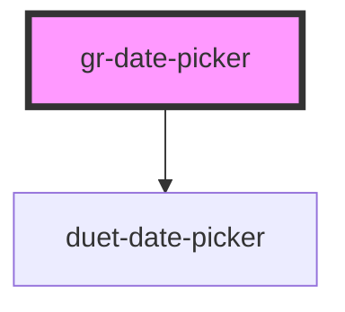

# gr-date-picker

<!-- Auto Generated Below -->

## Properties

| Property            | Attribute            | Description                                                                                                                                                                                                                    | Type                                                                                                                                                      | Default             |
| ------------------- | -------------------- | ------------------------------------------------------------------------------------------------------------------------------------------------------------------------------------------------------------------------------ | --------------------------------------------------------------------------------------------------------------------------------------------------------- | ------------------- |
| `direction`         | `direction`          | Forces the opening direction of the calendar modal to be always left or right. This setting can be useful when the input is smaller than the opening date picker would be as by default the picker always opens towards right. | `"left" \| "right"`                                                                                                                                       | `'right'`           |
| `disabled`          | `disabled`           | Makes the date picker input component disabled. This prevents users from being able to interact with the input, and conveys its inactive state to assistive technologies.                                                      | `boolean`                                                                                                                                                 | `false`             |
| `firstDayOfWeek`    | `first-day-of-week`  | Which day is considered first day of the week? `0` for Sunday, `1` for Monday, etc. Default is Monday.                                                                                                                         | `DaysOfWeek.Friday \| DaysOfWeek.Monday \| DaysOfWeek.Saturday \| DaysOfWeek.Sunday \| DaysOfWeek.Thursday \| DaysOfWeek.Tuesday \| DaysOfWeek.Wednesday` | `DaysOfWeek.Monday` |
| `helpText`          | `help-text`          | The date picker's help text. Alternatively, you can use the help-text slot.                                                                                                                                                    | `string`                                                                                                                                                  | `''`                |
| `invalid`           | `invalid`            | Set to true to indicate this field is invalid. Will display the invalid text instead of the help text                                                                                                                          | `boolean`                                                                                                                                                 | `false`             |
| `invalidText`       | `invalid-text`       | The date picker's invalid text. Alternatively, you can use the invalid-text slot.                                                                                                                                              | `string`                                                                                                                                                  | `''`                |
| `isDateDisabled`    | --                   | Controls which days are disabled and therefore disallowed. For example, this can be used to disallow selection of weekends.                                                                                                    | `(date: Date) => boolean`                                                                                                                                 | `() => false`       |
| `label`             | `label`              | The date picker's label. Alternatively, you can use the label slot.                                                                                                                                                            | `string`                                                                                                                                                  | `''`                |
| `max`               | `max`                | Maximum date allowed to be picked. Must be in IS0-8601 format: YYYY-MM-DD. This setting can be used alone or together with the min property.                                                                                   | `string`                                                                                                                                                  | `''`                |
| `min`               | `min`                | Minimum date allowed to be picked. Must be in IS0-8601 format: YYYY-MM-DD. This setting can be used alone or together with the max property.                                                                                   | `string`                                                                                                                                                  | `''`                |
| `name`              | `name`               | Name of the date picker input.                                                                                                                                                                                                 | `string`                                                                                                                                                  | `''`                |
| `placeholder`       | `placeholder`        | The date picker input's placeholder text.                                                                                                                                                                                      | `string`                                                                                                                                                  | `''`                |
| `requiredIndicator` | `required-indicator` | Set to true to display a required indicator, adds an asterisk to label                                                                                                                                                         | `boolean`                                                                                                                                                 | `false`             |
| `value`             | `value`              | Date value. Must be in IS0-8601 format: YYYY-MM-DD.                                                                                                                                                                            | `string`                                                                                                                                                  | `''`                |

## Events

| Event       | Description                                     | Type                                                                              |
| ----------- | ----------------------------------------------- | --------------------------------------------------------------------------------- |
| `gr-blur`   | Emitted when the date picker input loses focus. | `CustomEvent<void>`                                                               |
| `gr-change` | Emitted when a date is selected.                | `CustomEvent<{ component: "gr-date-picker"; valueAsDate: Date; value: string; }>` |
| `gr-close`  | Emitted when the panel closes.                  | `CustomEvent<void>`                                                               |
| `gr-focus`  | Emitted when the date picker input gains focus. | `CustomEvent<void>`                                                               |
| `gr-open`   | Emitted when the panel opens.                   | `CustomEvent<void>`                                                               |

## Methods

### `hide(moveFocusToButton?: boolean) => Promise<void>`

Hide the calendar modal. Set `moveFocusToButton` to false to prevent focus
returning to the date picker's button. Default is true.

#### Returns

Type: `Promise<void>`

### `setFocus() => Promise<void>`

Sets focus on the date picker's input. Use this method instead of the global `focus()`.

#### Returns

Type: `Promise<void>`

### `show() => Promise<void>`

Show the calendar modal, moving focus to the calendar inside.

#### Returns

Type: `Promise<void>`

## CSS Custom Properties

| Name                                 | Description                                                                        |
| ------------------------------------ | ---------------------------------------------------------------------------------- |
| `--backdrop-color`                   | Background color of the backdrop (used on small viewports)                         |
| `--button-background-color`          | Background color of the calendar button                                            |
| `--button-color`                     | Text color of the calendar button                                                  |
| `--focus-border-color`               | The border color to use when controls receives focus.                              |
| `--focus-ring`                       | The focus ring style to use when controls receives focus, a `box-shadow` property. |
| `--input-background-color`           | Background color of the input                                                      |
| `--input-background-color-invalid`   | Background color of the input when invalid                                         |
| `--input-border-color`               | Border color of the input                                                          |
| `--input-border-color-hover`         | Border color of the input on hover                                                 |
| `--input-border-color-invalid`       | Border color of the input when invalid                                             |
| `--input-border-color-invalid-hover` | Border color of the input when invalid on hover                                    |
| `--input-color`                      | Text color of the input                                                            |
| `--min-height`                       | Minimum height of the input                                                        |
| `--panel-background-color`           | Background color of the panel                                                      |
| `--panel-border-color`               | Border color of the panel                                                          |
| `--panel-border-radius`              | Border radius of the panel                                                         |
| `--panel-box-shadow`                 | Box shadow of the panel                                                            |
| `--placeholder-color`                | Text color of the placeholder                                                      |
| `--selected-day-background-color`    | Background color of the selected day indicator                                     |
| `--selected-day-color`               | Text color of the selected day indicator                                           |

## Dependencies

### Depends on

- duet-date-picker

### Graph

----------------------------------------------

*Built with [StencilJS](https://stenciljs.com/)*
