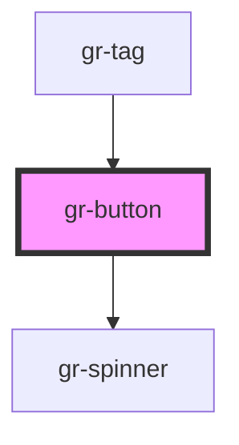

# gr-button

<!-- Auto Generated Below -->

## Properties

| Property   | Attribute  | Description                                                                                                                                                                            | Type                                                           | Default     |
| ---------- | ---------- | -------------------------------------------------------------------------------------------------------------------------------------------------------------------------------------- | -------------------------------------------------------------- | ----------- |
| `caret`    | `caret`    | Set to true to draw the button with a caret for use with dropdowns, popovers, etc.                                                                                                     | `boolean`                                                      | `false`     |
| `circle`   | `circle`   | Set to true to draw a circle button.                                                                                                                                                   | `boolean`                                                      | `false`     |
| `disabled` | `disabled` | If `true`, the user cannot interact with the button.                                                                                                                                   | `boolean`                                                      | `false`     |
| `expand`   | `expand`   | Set to `"block"` for a full-width button or to `"full"` for a full-width button without left and right borders.                                                                        | `"block" \| "full"`                                            | `undefined` |
| `href`     | `href`     | Contains a URL or a URL fragment that the hyperlink points to.                                                                                                                         | `string`                                                       | `undefined` |
| `loading`  | `loading`  | Set to true to draw the button in a loading state.                                                                                                                                     | `boolean`                                                      | `false`     |
| `pill`     | `pill`     | Set to true to draw a pill-style button with rounded edges.                                                                                                                            | `boolean`                                                      | `false`     |
| `rel`      | `rel`      | Specifies the relationship of the target object to the link object. The value is a space-separated list of [link types](https://developer.mozilla.org/en-US/docs/Web/HTML/Link_types). | `string`                                                       | `undefined` |
| `size`     | `size`     | The button's size.                                                                                                                                                                     | `"large" \| "medium" \| "small"`                               | `'medium'`  |
| `target`   | `target`   | Specifies where to display the linked URL. Special keywords: `"_blank"`, `"_self"`, `"_parent"`, `"_top"`.                                                                             | `string`                                                       | `undefined` |
| `type`     | `type`     | The type of the button.                                                                                                                                                                | `"button" \| "reset" \| "submit"`                              | `'button'`  |
| `variant`  | `variant`  | The different variants. The options are: `"default"`, `"primary"`, `"secondary"`, `"danger"`, and `"plain"`.                                                                           | `"danger" \| "default" \| "plain" \| "primary" \| "secondary"` | `'default'` |

## Events

| Event      | Description                          | Type                |
| ---------- | ------------------------------------ | ------------------- |
| `gr-blur`  | Emitted when the button loses focus. | `CustomEvent<void>` |
| `gr-focus` | Emitted when the button has focus.   | `CustomEvent<void>` |

## Methods

### `removeFocus() => Promise<void>`

Removes focus from the button.

#### Returns

Type: `Promise<void>`

### `setFocus(options?: FocusOptions) => Promise<void>`

Sets focus on the button.

#### Returns

Type: `Promise<void>`

## Slots

| Slot          | Description                                                                                                     |
| ------------- | --------------------------------------------------------------------------------------------------------------- |
|               | Content is placed between the named slots if provided without a slot.                                           |
| `"end"`       | Content is placed to the right of the button text (will be to the left when we support right-to-left direction) |
| `"icon-only"` | Should be used on an icon in a button that has no text.                                                         |
| `"start"`     | Content is placed to the left of the button text (will be to the right when we support right-to-left direction) |

## CSS Custom Properties

| Name                   | Description                                                                                                     |
| ---------------------- | --------------------------------------------------------------------------------------------------------------- |
| `--background`         | Background of the button                                                                                        |
| `--background-focus`   | Background of the button on focus                                                                               |
| `--background-hover`   | Background of the button on hover                                                                               |
| `--border-color`       | Border color of the button                                                                                      |
| `--border-color-focus` | Border color of the button on focus                                                                             |
| `--border-color-hover` | Border color of the button on hover                                                                             |
| `--border-radius`      | Border radius of the button                                                                                     |
| `--border-style`       | Border style of the button                                                                                      |
| `--border-width`       | Border width of the button                                                                                      |
| `--color`              | Text color of the button                                                                                        |
| `--color-focus`        | Text color of the button on focus                                                                               |
| `--color-hover`        | Text color of the button on hover                                                                               |
| `--focus-ring`         | The focus ring style to use when the button receives focus, a `box-shadow` property.                            |
| `--height`             | Height of the button                                                                                            |
| `--padding-bottom`     | Bottom padding of the button                                                                                    |
| `--padding-end`        | Right padding of the button (will be left padding when we support right-to-left direction)                      |
| `--padding-start`      | Left padding of the button (will be right padding when we support right-to-left direction)                      |
| `--padding-top`        | Top padding of the button                                                                                       |
| `--shadow`             | Shadow of the button, a `box-shadow` property. Please note this will be overwritted by `--focus-ring` on focus. |
| `--transition`         | Transition of the button                                                                                        |

## Dependencies

### Used by

 - [gr-tag](../tag)

### Depends on

- [gr-spinner](../spinner)

### Graph

----------------------------------------------

*Built with [StencilJS](https://stenciljs.com/)*
