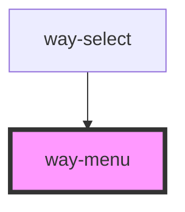

# way-menu

<!-- Auto Generated Below -->

## Events

| Event        | Description                           | Type                                             |
| ------------ | ------------------------------------- | ------------------------------------------------ |
| `way-select` | Emitted when a menu item is selected. | `CustomEvent<{ item: HTMLWayMenuItemElement; }>` |

## Methods

### `typeToSelect(key: string) => Promise<void>`

Initiates type-to-select logic, which automatically selects an option based on what the user is currently typing.
The key passed will be appended to the internal query and the selection will be updated. After a brief period, the
internal query is cleared automatically. This method is intended to be used with the keydown event. Useful for
enabling type-to-select when the menu doesn't have focus.

#### Returns

Type: `Promise<void>`

## Slots

| Slot | Description                                                               |
| ---- | ------------------------------------------------------------------------- |
|      | The menu's content, including menu items, menu dividers, and menu labels. |

## CSS Custom Properties

| Name               | Description                |
| ------------------ | -------------------------- |
| `--padding-bottom` | Bottom padding of the menu |
| `--padding-top`    | Top padding of the menu    |

## Dependencies

### Used by

 - [way-select](../way-select)

### Graph

----------------------------------------------

*Built with [StencilJS](https://stenciljs.com/)*
