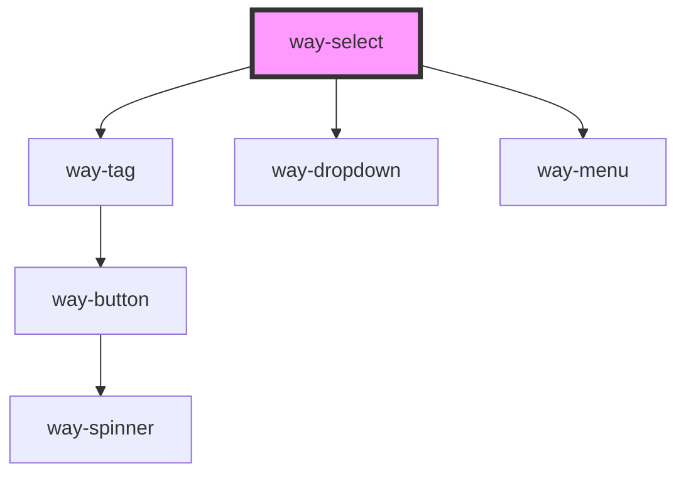

# way-select

<!-- Auto Generated Below -->

## Properties

| Property         | Attribute          | Description                                                                                                                                                                                    | Type                             | Default    |
| ---------------- | ------------------ | ---------------------------------------------------------------------------------------------------------------------------------------------------------------------------------------------- | -------------------------------- | ---------- |
| `clearable`      | `clearable`        | Set to true to add a clear button when the select is populated.                                                                                                                                | `boolean`                        | `false`    |
| `disabled`       | `disabled`         | Set to true to disable the select control.                                                                                                                                                     | `boolean`                        | `false`    |
| `helpText`       | `help-text`        | The select's help text. Alternatively, you can use the help-text slot.                                                                                                                         | `string`                         | `''`       |
| `hoist`          | `hoist`            | Enable this option to prevent the panel from being clipped when the component is placed inside a container with `overflow: auto\|scroll`.                                                      | `boolean`                        | `false`    |
| `invalid`        | `invalid`          | Set to true to indicate this field is invalid. Will display the invalid text instead of the help text                                                                                          | `boolean`                        | `false`    |
| `invalidText`    | `invalid-text`     | The select's invalid text. Alternatively, you can use the invalid-text slot.                                                                                                                   | `string`                         | `''`       |
| `label`          | `label`            | The select's label. Alternatively, you can use the label slot.                                                                                                                                 | `string`                         | `''`       |
| `maxTagsVisible` | `max-tags-visible` | The maximum number of tags to show when `multiple` is true. After the maximum, "+n" will be shown to indicate the number of additional items that are selected. Set to -1 to remove the limit. | `number`                         | `3`        |
| `multiple`       | `multiple`         | Set to true to enable multiselect.                                                                                                                                                             | `boolean`                        | `false`    |
| `name`           | `name`             | The select's name.                                                                                                                                                                             | `string`                         | `''`       |
| `pill`           | `pill`             | Set to true to draw a pill-style select with rounded edges.                                                                                                                                    | `boolean`                        | `false`    |
| `placeholder`    | `placeholder`      | The select's placeholder text.                                                                                                                                                                 | `string`                         | `''`       |
| `size`           | `size`             | The select's size.                                                                                                                                                                             | `"large" \| "medium" \| "small"` | `'medium'` |
| `value`          | `value`            | The value of the control. This will be a string or an array depending on `multiple`.                                                                                                           | `string \| string[]`             | `''`       |

## Events

| Event        | Description                               | Type                |
| ------------ | ----------------------------------------- | ------------------- |
| `way-blur`   | Emitted when the control loses focus.     | `CustomEvent<void>` |
| `way-change` | Emitted when the control's value changes. | `CustomEvent<void>` |
| `way-focus`  | Emitted when the control gains focus.     | `CustomEvent<void>` |

## Slots

| Slot             | Description                                                                                       |
| ---------------- | ------------------------------------------------------------------------------------------------- |
|                  | The select's options in the form of menu items.                                                   |
| `"help-text"`    | Help text that describes how to use the select. Alternatively, you can use the help-text prop.    |
| `"invalid-text"` | Invalid text tells a user how to fix the error. Alternatively, you can use the invalid-text prop. |
| `"label"`        | The select's label. Alternatively, you can use the label prop.                                    |

## CSS Custom Properties

| Name                               | Description                                                                                  |
| ---------------------------------- | -------------------------------------------------------------------------------------------- |
| `--background-color`               | Background color of the select                                                               |
| `--background-color-focus`         | Background color of the select on focus                                                      |
| `--background-color-hover`         | Background color of the select on hover                                                      |
| `--background-color-invalid`       | Background color of the select when invalid                                                  |
| `--background-color-invalid-hover` | Background color of the select when invalid on hover                                         |
| `--border-color`                   | Border color of the select                                                                   |
| `--border-color-focus`             | Border color of the select on focus                                                          |
| `--border-color-hover`             | Border color of the select on hover                                                          |
| `--border-color-invalid`           | Border color of the select when invalid                                                      |
| `--border-color-invalid-hover`     | Border color of the select when invalid on hover                                             |
| `--border-radius`                  | Border radius of the select                                                                  |
| `--caret-margin-end`               | Right margin of the caret (will be left margin when we support right-to-left direction)      |
| `--clear-icon-margin-end`          | Right margin of the clear icon (will be left margin when we support right-to-left direction) |
| `--color`                          | Text color of the select                                                                     |
| `--focus-ring`                     | The focus ring style to use when the control receives focus, a `box-shadow` property.        |
| `--font-size`                      | Font size of the select                                                                      |
| `--font-weight`                    | Font weight of the select                                                                    |
| `--label-margin-end`               | Right margin of the label (will be left margin when we support right-to-left direction)      |
| `--label-margin-start`             | Left margin of the label (will be right margin when we support right-to-left direction)      |
| `--min-height`                     | Minimum height of the select                                                                 |
| `--placeholder-color`              | Text color of the placeholder                                                                |
| `--tags-margin-end`                | Right margin of the tags (will be left margin when we support right-to-left direction)       |
| `--tags-padding-bottom`            | Bottom padding of the tags                                                                   |
| `--tags-padding-top`               | Top padding of the tags                                                                      |

## Dependencies

### Depends on

- [way-tag](../way-tag)
- [way-dropdown](../way-dropdown)
- [way-menu](../way-menu)

### Graph

----------------------------------------------

*Built with [StencilJS](https://stenciljs.com/)*
