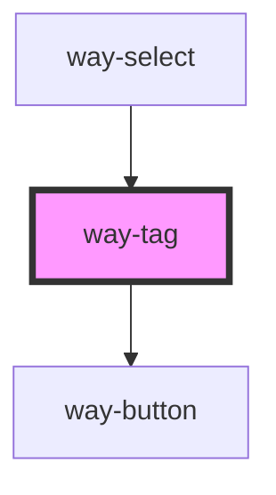

# way-tag

<!-- Auto Generated Below -->

## Properties

| Property    | Attribute   | Description                                              | Type                                                        | Default     |
| ----------- | ----------- | -------------------------------------------------------- | ----------------------------------------------------------- | ----------- |
| `clearable` | `clearable` | Set to true to make the tag clearable.                   | `boolean`                                                   | `false`     |
| `pill`      | `pill`      | Set to true to draw a pill-style tag with rounded edges. | `boolean`                                                   | `false`     |
| `size`      | `size`      | The tag's size.                                          | `"large" \| "medium" \| "small"`                            | `'medium'`  |
| `type`      | `type`      | The tag's type.                                          | `"danger" \| "info" \| "primary" \| "success" \| "warning"` | `'primary'` |

## Events

| Event       | Description                                 | Type               |
| ----------- | ------------------------------------------- | ------------------ |
| `way-clear` | Emitted when the clear button is activated. | `CustomEvent<any>` |

## Slots

| Slot | Description        |
| ---- | ------------------ |
|      | The tag's content. |

## CSS Custom Properties

| Name                   | Description                                                                             |
| ---------------------- | --------------------------------------------------------------------------------------- |
| `--background-color`   | Background color of the tag                                                             |
| `--border-color`       | Border color of the tag                                                                 |
| `--border-radius`      | Border radius of the tag                                                                |
| `--border-style`       | Border style of the tag                                                                 |
| `--border-width`       | Border width of the tag                                                                 |
| `--clear-color`        | Color of the clear icon                                                                 |
| `--clear-color-hover`  | Color of the clear icon on hover                                                        |
| `--clear-margin-left`  | Margin left of the clear icon                                                           |
| `--clear-margin-right` | Margin right of the clear icon                                                          |
| `--color`              | Text color of the tag                                                                   |
| `--font-size`          | Font size of the tag                                                                    |
| `--height`             | Height of the tag                                                                       |
| `--line-height`        | Line height of the tag                                                                  |
| `--padding-bottom`     | Bottom padding of the tag                                                               |
| `--padding-end`        | Right padding of the tag (will be left padding when we support right-to-left direction) |
| `--padding-start`      | Left padding of the tag (will be right padding when we support right-to-left direction) |
| `--padding-top`        | Top padding of the tag                                                                  |

## Dependencies

### Used by

 - [way-select](../way-select)

### Depends on

- [way-button](../way-button)

### Graph

----------------------------------------------

*Built with [StencilJS](https://stenciljs.com/)*
